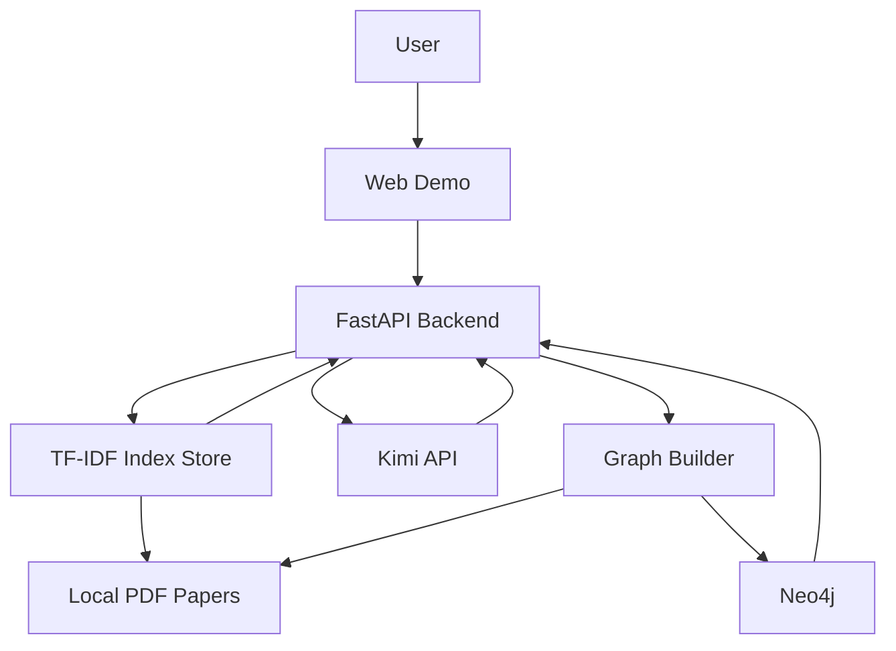

# CropRAG-Research-Assistant

一个面向农作物分类论文场景的 AI 应用开发项目。系统基于真实 PDF 论文数据，完成了从文档解析、检索增强问答，到实体关系抽取、Neo4j 图谱构建和图谱增强回答的完整链路。

## 项目亮点

- 基于 `Kimi` Anthropic 兼容接口完成大模型接入
- 基于真实农作物分类论文构建 `RAG + Knowledge Graph` 问答系统
- 支持 PDF 索引构建、来源引用、实体抽取、图谱检索和图谱增强问答
- 提供可视化 Web Demo、处理进度展示和本地部署说明

## 技术栈

- Backend: `FastAPI`
- LLM: `Kimi API (Anthropic-compatible)`
- Retrieval: `Pure Python TF-IDF sparse retrieval`
- Graph: `Neo4j local harness`
- Frontend: `Vanilla HTML / CSS / JavaScript`

## 数据集

- 本地论文目录：`E:\crop_paper\农作物分类论文`
- 已索引 PDF：`17`
- 当前图谱规模：`17 documents / 258 entities / 662 relations`

## 核心能力

### 1. 文档上传与索引构建

- 支持本地 PDF 论文读取和上传
- 支持文本抽取、Chunk 切分和 TF-IDF 索引构建
- 支持索引构建进度展示

### 2. 检索增强问答

- 根据用户问题召回相关论文片段
- 使用 Kimi 基于检索结果生成答案
- 返回来源片段、页码和分数，增强可解释性

### 3. 中文问题到英文论文召回

- 当前检索采用 `TF-IDF` 稀疏检索，不是语义 embedding 检索
- 针对中文问题与英文论文语料之间词面不一致的问题，引入 Kimi 查询改写
- 先将中文问题改写为更适合英文论文召回的关键词，再进行检索，提高跨语言召回效果

### 4. 图谱增强

- 使用 Kimi 从论文片段中抽取实体与关系
- 将实体关系写入 Neo4j
- 在问答时联合图谱事实进行增强回答

### 5. 工程化展示

- 提供作品集首页和交互式工作台
- 支持索引和建图进度可视化
- 提供健康检查、状态接口和部署说明

## 系统架构



## 本地运行

### 1. 安装依赖

```powershell
cd D:\文档\Playground\project-3-kimi-rag-mvp
pip install -r requirements.txt
```

### 2. 配置 Kimi

```powershell
$env:ANTHROPIC_BASE_URL='https://api.kimi.com/coding/'
$env:ANTHROPIC_AUTH_TOKEN=''
$env:ANTHROPIC_API_KEY='your-kimi-key'
```

### 3. 启动 Neo4j Harness

```powershell
cd D:\文档\Playground\project-3-kimi-rag-mvp\runtime
powershell -ExecutionPolicy Bypass -File .\start_neo4j_harness.ps1
```

停止命令：

```powershell
cd D:\文档\Playground\project-3-kimi-rag-mvp\runtime
powershell -ExecutionPolicy Bypass -File .\stop_neo4j_harness.ps1
```

说明：

- Neo4j harness 默认监听 `bolt://localhost:7687`
- 当前 harness 为内存态，重启后需要重新执行一次建图

### 4. 启动应用

```powershell
cd D:\文档\Playground\project-3-kimi-rag-mvp
$env:NEO4J_URI='bolt://localhost:7687'
$env:NEO4J_AUTH_ENABLED='false'
python app.py
```

访问地址：

- `http://127.0.0.1:8010`

## API

- `GET /api/health`
- `GET /api/index/status`
- `GET /api/index/progress`
- `POST /api/index/build`
- `GET /api/graph/status`
- `GET /api/graph/progress`
- `POST /api/graph/build`
- `POST /api/graph/search`
- `POST /api/chat`
- `POST /api/upload`

## 建议演示问题

- `这些论文中常见的农作物分类方法有哪些？`
- `哪些论文提到了 Support Vector Machine 或 Random Forest？`
- `这些论文中常见的数据源、传感器和分类任务分别是什么？`

## 项目目录

```text
project-3-kimi-rag-mvp/
├─ app.py
├─ requirements.txt
├─ rag_mvp/
├─ static/
├─ runtime/
├─ docs/
└─ data/
```

## 项目材料

- `docs/screenshots/overview.svg`
- `docs/screenshots/workspace.svg`
- `docs/screenshots/architecture.svg`

## 项目总结

这个项目覆盖了 AI 应用开发岗位中比较核心的一条完整链路：真实文档处理、检索增强问答、大模型调用、知识图谱集成、后端接口开发和可视化展示。相比纯聊天类 Demo，它更强调数据处理、检索设计、系统集成和工程化落地能力。