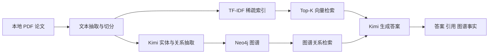

# CropRAG Portfolio Guide

## 项目定位

`CropRAG` 是一个面向 AI 应用开发岗位的作品集项目，使用真实农作物分类论文 PDF 构建问答系统，并在基础 RAG 上增加实体抽取、知识图谱和图谱关系检索能力。

## 核心链路

## 展示建议

- 首页截图：强调真实数据、技术栈和作品集定位。
- 工作台截图：展示索引进度、建图进度、问答结果和来源片段。
- 架构图截图：展示系统模块和技术路线，便于面试讲解。

## 面试讲法

1. 先介绍业务场景：农业遥感论文检索和作物分类研究辅助。
2. 再讲基础链路：PDF -> chunk -> 稀疏索引 -> Kimi 问答。
3. 然后强调增强点：Kimi 抽实体关系，Neo4j 做图谱落地与检索补充。
4. 最后讲工程化：处理进度、状态接口、回退策略和本地部署。
