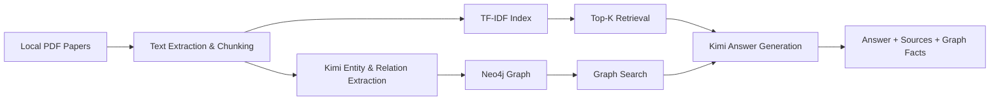

# CropRAG Portfolio Guide

## 项目定位

`CropRAG-Research-Assistant` 是一个面向 AI 应用开发岗位的作品集项目。它以真实农作物分类论文 PDF 为数据源，构建了一个包含文档索引、检索增强问答、实体关系抽取、Neo4j 图谱构建和图谱增强问答的完整系统。

## 适合怎么讲

面试时建议按照下面这条主线来讲：

1. 业务场景：围绕农作物分类论文做知识检索和研究辅助。
2. 基础链路：PDF 解析 -> 文本切分 -> TF-IDF 检索 -> Kimi 生成答案。
3. 增强链路：Kimi 抽取实体关系 -> Neo4j 落图 -> 图谱关系检索增强回答。
4. 工程化：进度展示、状态接口、失败回退、本地部署和作品集页面。

## 核心能力拆解

### 文档处理

- 读取本地论文 PDF
- 抽取文本并按 Chunk 切分
- 构建可检索的稀疏索引

### 问答链路

- 先从索引中召回相关论文片段
- 再调用 Kimi 生成有来源引用的答案
- 来源片段包含文件名、页码和相关性分数

### 跨语言召回

- 论文内容以英文为主，用户问题往往是中文
- 当前项目使用的是 TF-IDF 稀疏检索，不是多语 embedding 检索
- 因此增加了查询改写步骤，将中文问题转换为更适合英文语料召回的检索表达

### 图谱增强

- 使用 Kimi 从论文片段中提取方法、任务、数据集、传感器等实体
- 将实体和关系写入 Neo4j
- 在问答阶段联合图谱事实输出更结构化的结果

## 系统架构

## 页面展示建议

- 首页：突出真实数据、技术栈、项目定位和工作台入口。
- 工作台：展示索引构建、图谱构建、问答结果、来源片段和图谱事实。
- 架构区：展示系统模块之间的关系，便于快速讲清技术方案。

## 简历表达建议

可以写成下面这种风格：

- 基于真实农作物分类论文构建 RAG + 知识图谱增强问答系统，支持 PDF 解析、TF-IDF 检索、来源引用和图谱事实联动。
- 接入 Kimi Anthropic 兼容接口，实现中文问题查询改写、答案生成和实体关系抽取，并将结果写入 Neo4j。
- 使用 FastAPI 完成上传、索引、建图、问答和状态接口开发，搭建可用于作品集展示的 Web Demo 页面。

## 面试时可强调的点

- 这不是纯聊天壳子，而是有真实数据处理和检索链路的 AI 应用。
- 选择 TF-IDF 是为了降低复现复杂度和部署门槛，同时保留完整的 RAG 结构。
- 中文到英文论文的召回改写，是对跨语言稀疏检索问题的工程化补偿。
- 图谱增强让系统不仅能给答案，还能给出结构化关系依据。